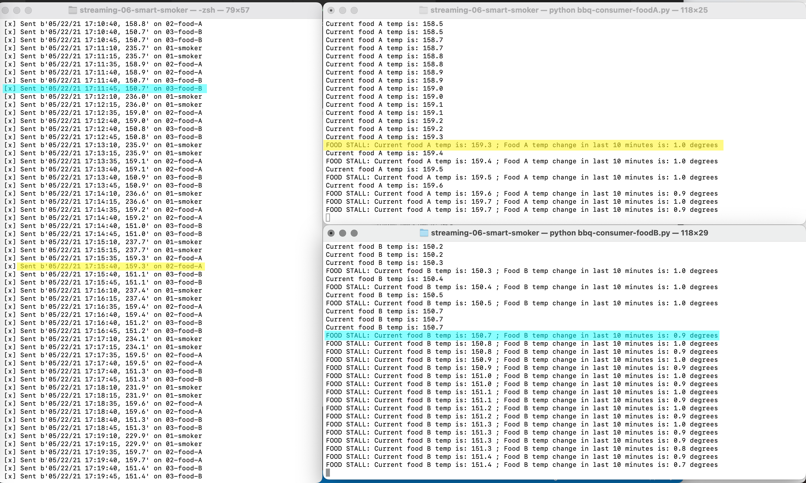
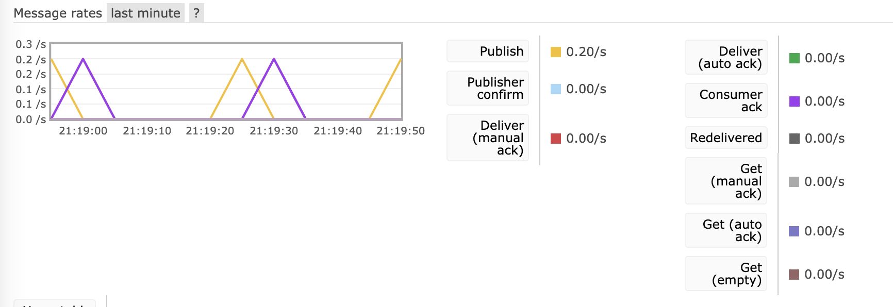

## streaming-06-smart-smoker
# Sarah Windeknecht
February 21, 2023

The Smart Smoker program reads a csv file and creates a producer with three task-queues.

The program simulates a streaming series of temperature readings from a smart smoker and two foods, reading the temperatures every half minute.

The smoker-temp.csv file has four columns:
    [0] Date-time stamp
    [1] Smoker temperature
    [2] Food A temperature
    [3] Food B temperature

Three consumers listen to the producer, with one consumer per temperature queue.

# Significant Events

We want know if:

SMOKER ALERT: The smoker temperature decreases by 15 degrees F or more in 2.5 minutes (5 readings).

FOOD STALL: Either food temperature changes by 1 degree F or less in 10 minutes (20 minutes).

The user is alerted when a significant occurs.

## Prerequisites

RabbitMQ server running

Pika installed in the active Python environment

## Running the Program

1. Open Terminal
2. Run bbq-producer.py

To open the RabbitMQ Admin page, set show_offer = "False", or set show_offer = "True" to be given the option.

3. Run bbq-consumer-smoker.py, bbq-consumer-foodA.py, and bbq-consumer-foodB.py

## Screenshot

See a running example with 4 concurrent process windows:

See a significant event example for the smoker, with timestamp:

See significant event examples for foods A and B, with timestamps:

An interesting part of the RabbitMQ console:

